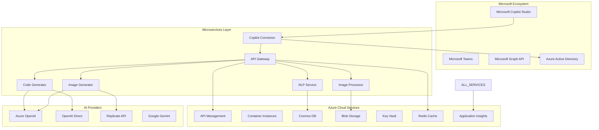
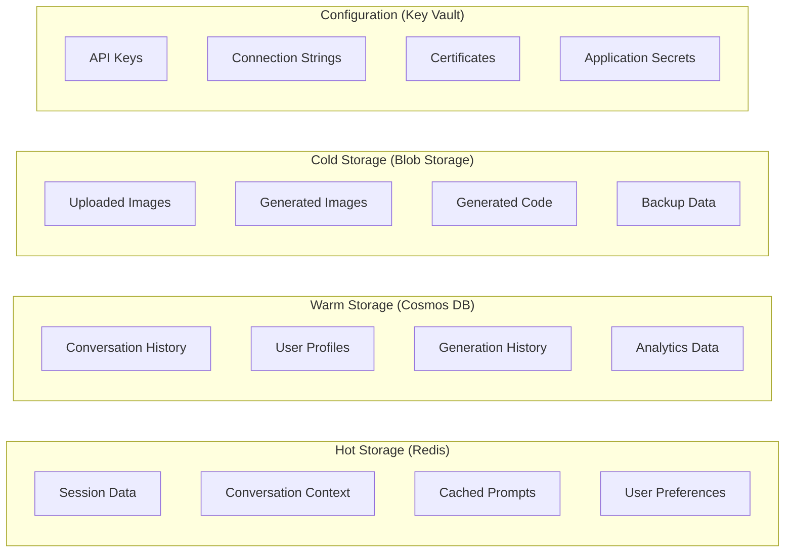
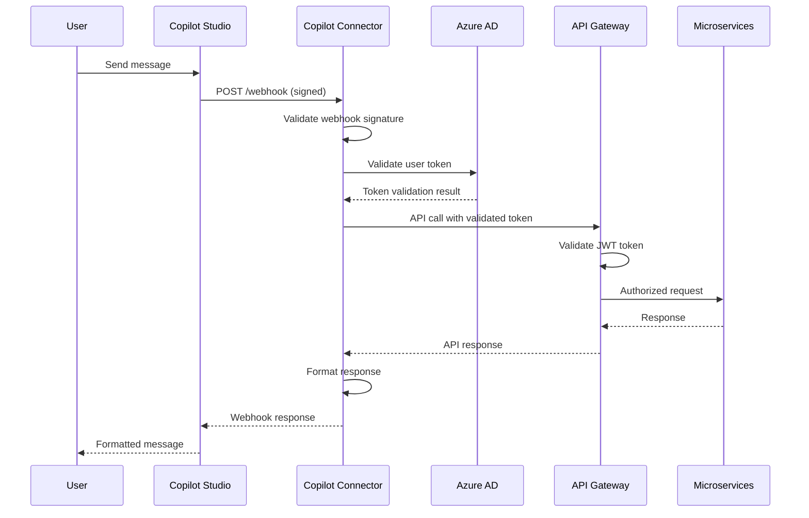

# System Design Document
## Screenshot-to-Code Microsoft Copilot Studio AI Agent

### Document Information
- **Version**: 1.0
- **Date**: January 2024
- **Architecture**: Microservices with Microsoft Copilot Studio Integration
- **Status**: Design Phase

---

## 1. SYSTEM ARCHITECTURE OVERVIEW

### 1.1 High-Level Architecture


### 1.2 Architecture Principles
- **Microservices**: Independent, scalable services with single responsibilities
- **Cloud-Native**: Leveraging Azure PaaS services for scalability and management
- **API-First**: All functionality exposed through well-documented APIs
- **Security by Design**: Zero-trust security model with Azure AD integration
- **Observability**: Comprehensive monitoring, logging, and alerting
- **Resilience**: Circuit breakers, retry mechanisms, and graceful degradation

---

## 2. SERVICE ARCHITECTURE

### 2.1 Microservices Breakdown

#### 2.1.1 API Gateway Service
```yaml
Purpose: Unified entry point for all API requests
Technology: FastAPI + Azure API Management
Port: 8000
Health Check: /health

Responsibilities:
  - Request routing and load balancing
  - Authentication and authorization
  - Rate limiting and throttling
  - Request/response validation
  - API versioning and documentation
  - Metrics collection and monitoring

Key Components:
  - Gateway Router (routes incoming requests)
  - Auth Middleware (validates Azure AD tokens)
  - Rate Limiter (prevents API abuse)
  - Request Validator (validates input schemas)
  - Response Formatter (standardizes response format)
  - Metrics Collector (collects usage statistics)

Configuration:
  cors_origins: ["https://copilotstudio.microsoft.com", "https://teams.microsoft.com"]
  rate_limit: 100 requests/minute/user
  timeout: 30 seconds
  retry_attempts: 3
```

#### 2.1.2 Copilot Connector Service
```yaml
Purpose: Handle Microsoft Copilot Studio integration
Technology: FastAPI + Microsoft Bot Framework SDK
Port: 8001
Health Check: /health

Responsibilities:
  - Webhook handling from Copilot Studio
  - Message parsing and attachment processing
  - Response formatting for Copilot Studio
  - Conversation state management
  - User session tracking
  - Rich message creation (adaptive cards)

Key Components:
  - Webhook Handler (processes Copilot Studio webhooks)
  - Message Parser (extracts intent and entities)
  - Attachment Processor (handles image uploads)
  - Response Formatter (creates adaptive cards)
  - Conversation Manager (maintains conversation state)
  - Session Store (manages user sessions)

Configuration:
  webhook_secret: stored in Azure Key Vault
  session_timeout: 30 minutes
  max_attachment_size: 10MB
  supported_formats: ["png", "jpg", "jpeg", "webp"]
```

#### 2.1.3 NLP Processing Service
```yaml
Purpose: Natural language understanding and conversation management
Technology: FastAPI + spaCy/transformers
Port: 8002
Health Check: /health

Responsibilities:
  - Intent classification from user messages
  - Entity extraction (frameworks, components, styles)
  - Conversation context management
  - Multi-turn conversation support
  - Language detection and processing
  - Response generation and personalization

Key Components:
  - Intent Classifier (classifies user intents)
  - Entity Extractor (extracts relevant entities)
  - Context Manager (maintains conversation context)
  - Language Detector (detects user language)
  - Response Generator (generates contextual responses)
  - Preference Learner (learns user preferences)

Models:
  - Intent Classification: Custom trained model
  - Entity Recognition: spaCy NER model
  - Language Detection: langdetect library
  - Context Embedding: sentence-transformers

Supported Intents:
  - CREATE_FROM_SCREENSHOT: Generate code from uploaded screenshot
  - CREATE_FROM_DESCRIPTION: Generate mockup and code from description
  - MODIFY_EXISTING: Modify existing generated code
  - EXPLAIN_CODE: Explain generated code functionality
  - SELECT_FRAMEWORK: Choose specific framework for generation
```

#### 2.1.4 Image Processor Service
```yaml
Purpose: Screenshot analysis and visual component extraction
Technology: FastAPI + OpenCV + PIL
Port: 8003
Health Check: /health

Responsibilities:
  - Image validation and preprocessing
  - Screenshot analysis and component detection
  - Layout structure extraction
  - Visual element identification
  - Component hierarchy mapping
  - Metadata extraction and storage

Key Components:
  - Image Validator (validates uploaded images)
  - Preprocessor (resizes, normalizes images)
  - Component Detector (identifies UI components)
  - Layout Analyzer (extracts layout structure)
  - Metadata Extractor (extracts image metadata)
  - Storage Manager (manages image storage)

Processing Pipeline:
  1. Image validation and security scan
  2. Preprocessing and normalization
  3. Component detection and classification
  4. Layout analysis and hierarchy extraction
  5. Metadata extraction and annotation
  6. Result storage and caching

Supported Analysis:
  - UI Components: buttons, forms, navigation, cards
  - Layout Patterns: grid, flex, absolute positioning
  - Visual Elements: typography, colors, spacing
  - Interactive Elements: links, buttons, form controls
```

#### 2.1.5 Code Generator Service
```yaml
Purpose: AI-powered code generation from analysis results
Technology: FastAPI + Multi-AI Provider Integration
Port: 8004
Health Check: /health

Responsibilities:
  - Multi-provider AI integration (Azure OpenAI, OpenAI, Gemini)
  - Framework-specific code generation
  - Prompt engineering and optimization
  - Code validation and formatting
  - Version control and iteration support
  - Quality assessment and improvement

Key Components:
  - Provider Router (selects optimal AI provider)
  - Prompt Engineer (creates optimized prompts)
  - Code Generator (generates framework-specific code)
  - Code Validator (validates generated code syntax)
  - Code Formatter (formats code according to standards)
  - Quality Assessor (evaluates generated code quality)

Supported Frameworks:
  - HTML + Tailwind CSS
  - HTML + CSS
  - React + Tailwind CSS
  - Vue + Tailwind CSS
  - Bootstrap 5
  - Ionic + Tailwind CSS
  - SVG Graphics

AI Provider Integration:
  - Azure OpenAI: Primary provider for enterprise customers
  - OpenAI Direct: Fallback for Azure OpenAI outages
  - Google Gemini: Alternative for specific use cases
  - Anthropic Claude: Future integration for enhanced reasoning

Code Quality Metrics:
  - Syntax validity: 100% requirement
  - Semantic accuracy: >90% target
  - Accessibility compliance: WCAG 2.1 AA
  - Performance optimization: Core Web Vitals compliance
```

#### 2.1.6 Image Generator Service
```yaml
Purpose: AI-powered mockup generation from natural language
Technology: FastAPI + Multi-Provider Image Generation
Port: 8005
Health Check: /health

Responsibilities:
  - Natural language to image prompt translation
  - Multi-provider image generation (DALL-E 3, Flux Schnell)
  - Cost optimization and provider selection
  - Image quality assessment and enhancement
  - Generated image analysis for code conversion
  - Usage tracking and cost monitoring

Key Components:
  - Prompt Translator (converts descriptions to image prompts)
  - Provider Selector (chooses optimal provider)
  - Image Generator (interfaces with AI providers)
  - Quality Assessor (evaluates generated image quality)
  - Cost Optimizer (minimizes generation costs)
  - Usage Tracker (monitors usage and costs)

Provider Configuration:
  Azure DALL-E 3:
    cost_per_image: $0.040
    quality_score: 9.5/10
    generation_time: 10-15 seconds
    use_case: High-quality, enterprise projects
    
  Replicate Flux Schnell:
    cost_per_image: $0.003
    quality_score: 8.5/10
    generation_time: 3-5 seconds
    use_case: Cost-sensitive, rapid prototyping

Selection Algorithm:
  - Default: Flux Schnell (cost-effective)
  - High-quality requirement: DALL-E 3
  - Enterprise customer: Azure DALL-E 3
  - Fallback chain: Primary → Secondary → Manual
```

---

## 3. DATA ARCHITECTURE

### 3.1 Data Storage Strategy


### 3.2 Database Design

#### 3.2.1 Cosmos DB Schema
```json
{
  "conversations": {
    "id": "conversation_id",
    "user_id": "azure_ad_user_id",
    "tenant_id": "azure_ad_tenant_id",
    "created_at": "timestamp",
    "updated_at": "timestamp",
    "status": "active|completed|abandoned",
    "context": {
      "current_intent": "string",
      "extracted_entities": {},
      "user_preferences": {},
      "conversation_history": []
    },
    "metadata": {
      "source": "copilot_studio|teams|direct",
      "user_agent": "string",
      "session_id": "string"
    }
  },
  
  "generations": {
    "id": "generation_id",
    "conversation_id": "conversation_id",
    "user_id": "azure_ad_user_id",
    "type": "code|image",
    "input": {
      "image_url": "blob_storage_url",
      "description": "string",
      "requirements": {}
    },
    "output": {
      "generated_content": {},
      "metadata": {},
      "quality_score": "float"
    },
    "provider_info": {
      "provider": "azure_openai|openai|replicate",
      "model": "string",
      "cost": "float",
      "generation_time": "float"
    },
    "created_at": "timestamp"
  },
  
  "user_profiles": {
    "id": "azure_ad_user_id",
    "tenant_id": "azure_ad_tenant_id",
    "display_name": "string",
    "preferences": {
      "preferred_frameworks": [],
      "coding_style": {},
      "language": "en|vi",
      "notification_settings": {}
    },
    "usage_statistics": {
      "total_generations": "int",
      "total_cost": "float",
      "last_activity": "timestamp"
    },
    "created_at": "timestamp",
    "updated_at": "timestamp"
  }
}
```

#### 3.2.2 Redis Cache Schema
```yaml
Session Data:
  key: "session:{session_id}"
  ttl: 1800 seconds (30 minutes)
  data:
    user_id: azure_ad_user_id
    conversation_id: current_conversation_id
    active_context: conversation_context_snapshot
    last_activity: timestamp

Conversation Context:
  key: "context:{conversation_id}"
  ttl: 7200 seconds (2 hours)
  data:
    messages: last_10_messages
    extracted_entities: current_entities
    user_preferences: active_preferences
    generation_state: current_generation_status

Cached Prompts:
  key: "prompt:{hash}"
  ttl: 86400 seconds (24 hours)
  data:
    prompt_template: optimized_prompt
    provider: recommended_provider
    parameters: optimal_parameters
    success_rate: historical_success_rate

User Preferences:
  key: "prefs:{user_id}"
  ttl: 3600 seconds (1 hour)
  data:
    frameworks: preferred_frameworks
    styles: preferred_styles
    language: user_language
    quality_settings: quality_preferences
```

### 3.3 Blob Storage Organization
```
screenshot-to-code-storage/
├── images/
│   ├── uploaded/
│   │   ├── {year}/{month}/{day}/
│   │   │   └── {user_id}_{timestamp}_{hash}.{ext}
│   └── generated/
│       ├── {year}/{month}/{day}/
│       │   └── {generation_id}_{timestamp}.png
├── code/
│   ├── generated/
│   │   ├── {year}/{month}/{day}/
│   │   │   └── {generation_id}/
│   │   │       ├── index.html
│   │   │       ├── styles.css
│   │   │       └── script.js
├── templates/
│   ├── frameworks/
│   │   ├── react/
│   │   ├── vue/
│   │   └── html/
└── backups/
    ├── daily/
    ├── weekly/
    └── monthly/
```

---

## 4. SECURITY ARCHITECTURE

### 4.1 Authentication & Authorization Flow


### 4.2 Security Controls

#### 4.2.1 Identity & Access Management
```yaml
Azure Active Directory Integration:
  - Single Sign-On (SSO) for all services
  - Multi-Factor Authentication (MFA) support
  - Conditional Access policies
  - Privileged Identity Management (PIM)

Role-Based Access Control:
  User Roles:
    - Standard User: Basic code generation features
    - Premium User: Advanced features and higher limits
    - Admin User: System administration and analytics
    - Service Account: Inter-service communication

  Permissions:
    - generate:code (generate code from screenshots)
    - generate:image (generate mockups from descriptions)
    - access:history (view conversation history)
    - manage:preferences (modify user preferences)
    - view:analytics (access usage analytics)
    - admin:system (system administration)

API Security:
  - JWT token validation on all endpoints
  - Request signature verification for webhooks
  - Rate limiting per user and tenant
  - Input validation and sanitization
  - SQL injection prevention
  - XSS protection headers
```

#### 4.2.2 Data Protection
```yaml
Encryption:
  Data at Rest:
    - Azure Key Vault for secrets and certificates
    - Cosmos DB encryption with customer-managed keys
    - Blob Storage encryption with Azure-managed keys
    - Redis cache encryption in transit and at rest

  Data in Transit:
    - TLS 1.3 for all API communication
    - HTTPS enforced for all web traffic
    - Certificate pinning for external API calls
    - VNet integration for inter-service communication

Data Classification:
  - Public: Framework templates, documentation
  - Internal: Generated code, user preferences
  - Confidential: User conversations, analytics data
  - Restricted: API keys, connection strings, certificates

Privacy Controls:
  - GDPR compliance with data portability
  - Right to erasure implementation
  - Data retention policies (90 days default)
  - Consent management for data processing
  - Data residency controls by geography
```

#### 4.2.3 Network Security
```yaml
Network Architecture:
  - Azure Virtual Network (VNet) isolation
  - Network Security Groups (NSGs) for traffic filtering
  - Application Gateway with Web Application Firewall (WAF)
  - DDoS protection standard
  - Private endpoints for Azure services

API Security:
  - OWASP Top 10 compliance
  - Regular security scanning and penetration testing
  - Automated vulnerability assessment
  - Security headers enforcement
  - CORS policy enforcement

Monitoring & Alerting:
  - Azure Security Center integration
  - Azure Sentinel for security information and event management (SIEM)
  - Real-time threat detection
  - Automated incident response
  - Security audit logging
```

---

## 5. INTEGRATION ARCHITECTURE

### 5.1 Microsoft Copilot Studio Integration

#### 5.1.1 Webhook Configuration
```yaml
Webhook Endpoint: https://api.screenshot-to-code.com/v1/copilot/webhook
Authentication: HMAC-SHA256 signature validation
Timeout: 30 seconds
Retry Policy: 3 attempts with exponential backoff

Supported Events:
  - message: User sends text or image message
  - attachment: User uploads file attachment
  - action: User clicks interactive element
  - session_start: New conversation begins
  - session_end: Conversation ends or times out

Message Types:
  Inbound:
    - text: Plain text message from user
    - image: Image attachment with metadata
    - action: Button click or form submission
    
  Outbound:
    - text: Simple text response
    - adaptive_card: Rich interactive response
    - typing: Typing indicator during processing
    - error: Error message with recovery options
```

#### 5.1.2 Adaptive Card Templates
```json
{
  "code_generation_result": {
    "type": "AdaptiveCard",
    "version": "1.5",
    "body": [
      {
        "type": "TextBlock",
        "text": "Generated Code",
        "size": "large",
        "weight": "bolder"
      },
      {
        "type": "Container",
        "items": [
          {
            "type": "CodeBlock",
            "codeSnippet": "{generated_code}",
            "language": "{framework}"
          }
        ]
      },
      {
        "type": "FactSet",
        "facts": [
          {
            "title": "Framework:",
            "value": "{framework}"
          },
          {
            "title": "Generated at:",
            "value": "{timestamp}"
          }
        ]
      }
    ],
    "actions": [
      {
        "type": "Action.OpenUrl",
        "title": "Preview",
        "url": "{preview_url}"
      },
      {
        "type": "Action.Submit",
        "title": "Modify",
        "data": {
          "action": "modify_code",
          "generation_id": "{generation_id}"
        }
      }
    ]
  }
}
```

### 5.2 AI Provider Integration

#### 5.2.1 Provider Abstraction Layer
```python
# AI Provider Interface
from abc import ABC, abstractmethod
from typing import Dict, Any, AsyncIterator

class AIProvider(ABC):
    @abstractmethod
    async def generate_code(
        self, 
        prompt: str, 
        image_data: bytes = None,
        **kwargs
    ) -> Dict[str, Any]:
        pass
    
    @abstractmethod
    async def generate_image(
        self, 
        prompt: str, 
        **kwargs
    ) -> Dict[str, Any]:
        pass
    
    @abstractmethod
    async def stream_response(
        self, 
        prompt: str, 
        **kwargs
    ) -> AsyncIterator[str]:
        pass

# Azure OpenAI Implementation
class AzureOpenAIProvider(AIProvider):
    def __init__(self):
        self.client = AzureOpenAI(
            api_key=config.AZURE_OPENAI_API_KEY,
            api_version=config.AZURE_OPENAI_API_VERSION,
            azure_endpoint=config.AZURE_OPENAI_ENDPOINT
        )
    
    async def generate_code(self, prompt: str, image_data: bytes = None, **kwargs):
        messages = [
            {"role": "system", "content": self._get_system_prompt(kwargs.get("framework"))},
            {"role": "user", "content": [
                {"type": "text", "text": prompt},
                {"type": "image_url", "image_url": {"url": f"data:image/jpeg;base64,{base64.encode(image_data)}"}}
            ]}
        ]
        
        response = await self.client.chat.completions.create(
            model="gpt-4-vision-preview",
            messages=messages,
            max_tokens=4000,
            temperature=0.1
        )
        
        return {
            "content": response.choices[0].message.content,
            "usage": response.usage.model_dump(),
            "model": response.model,
            "provider": "azure_openai"
        }

# Provider Router
class ProviderRouter:
    def __init__(self):
        self.providers = {
            "azure_openai": AzureOpenAIProvider(),
            "openai": OpenAIProvider(),
            "replicate": ReplicateProvider(),
            "gemini": GeminiProvider()
        }
    
    async def select_provider(self, task_type: str, requirements: Dict) -> str:
        # Provider selection logic based on requirements
        if requirements.get("enterprise", False):
            return "azure_openai"
        elif requirements.get("cost_sensitive", False):
            return "replicate" if task_type == "image" else "gemini"
        else:
            return "azure_openai" if task_type == "code" else "replicate"
    
    async def execute_with_fallback(self, provider_name: str, method: str, *args, **kwargs):
        providers_to_try = [provider_name] + [p for p in self.providers.keys() if p != provider_name]
        
        for provider in providers_to_try:
            try:
                provider_instance = self.providers[provider]
                method_func = getattr(provider_instance, method)
                result = await method_func(*args, **kwargs)
                result["provider_used"] = provider
                return result
            except Exception as e:
                logger.warning(f"Provider {provider} failed: {str(e)}")
                continue
        
        raise Exception("All providers failed")
```

#### 5.2.2 Prompt Engineering System
```python
# Prompt Template Management
class PromptTemplate:
    def __init__(self, template_id: str, template_content: str, variables: List[str]):
        self.template_id = template_id
        self.template_content = template_content
        self.variables = variables
    
    def render(self, **kwargs) -> str:
        return self.template_content.format(**kwargs)

class PromptManager:
    def __init__(self):
        self.templates = {
            "react_code_generation": PromptTemplate(
                "react_code_generation",
                """You are an expert React developer. Convert the provided screenshot into clean, functional React code.

Requirements:
- Use React functional components with hooks
- Implement responsive design with Tailwind CSS
- Follow accessibility best practices (WCAG 2.1 AA)
- Include proper semantic HTML structure
- Add appropriate TypeScript types
- Framework: {framework}
- Style preferences: {style_preferences}
- Additional requirements: {additional_requirements}

Generate clean, production-ready code that matches the visual design exactly.""",
                ["framework", "style_preferences", "additional_requirements"]
            ),
            
            "image_generation": PromptTemplate(
                "image_generation",
                """Create a clean, modern web interface mockup based on this description:

Description: {description}
Style: {style}
Components needed: {components}
Color scheme: {color_scheme}
Layout type: {layout_type}

Generate a high-quality mockup that clearly shows:
- Layout structure and spacing
- Component hierarchy and relationships
- Visual design elements and styling
- Interactive elements and their states

The mockup should be suitable for converting to functional code.""",
                ["description", "style", "components", "color_scheme", "layout_type"]
            )
        }
    
    def get_template(self, template_id: str) -> PromptTemplate:
        return self.templates.get(template_id)
    
    def render_prompt(self, template_id: str, **kwargs) -> str:
        template = self.get_template(template_id)
        if not template:
            raise ValueError(f"Template {template_id} not found")
        
        # Validate required variables
        missing_vars = [var for var in template.variables if var not in kwargs]
        if missing_vars:
            raise ValueError(f"Missing required variables: {missing_vars}")
        
        return template.render(**kwargs)
```

---

## 6. DEPLOYMENT ARCHITECTURE

### 6.1 Container Architecture
```yaml
Container Images:
  api-gateway:
    base: python:3.11-slim
    port: 8000
    resources:
      memory: 512Mi
      cpu: 500m
    environment:
      - ENVIRONMENT
      - AZURE_CLIENT_ID
      - AZURE_CLIENT_SECRET
      - REDIS_CONNECTION_STRING
  
  copilot-connector:
    base: python:3.11-slim
    port: 8001
    resources:
      memory: 256Mi
      cpu: 250m
    environment:
      - COPILOT_WEBHOOK_SECRET
      - AZURE_CLIENT_ID
      - COSMOS_DB_CONNECTION
  
  nlp-service:
    base: python:3.11-slim
    port: 8002
    resources:
      memory: 1Gi
      cpu: 750m
    environment:
      - MODEL_CACHE_DIR
      - REDIS_CONNECTION_STRING
  
  image-processor:
    base: python:3.11-slim
    port: 8003
    resources:
      memory: 2Gi
      cpu: 1000m
    environment:
      - BLOB_STORAGE_CONNECTION
      - PROCESSING_TEMP_DIR
  
  code-generator:
    base: python:3.11-slim
    port: 8004
    resources:
      memory: 1Gi
      cpu: 750m
    environment:
      - AZURE_OPENAI_ENDPOINT
      - OPENAI_API_KEY
      - GEMINI_API_KEY
  
  image-generator:
    base: python:3.11-slim
    port: 8005
    resources:
      memory: 512Mi
      cpu: 500m
    environment:
      - REPLICATE_API_KEY
      - DALL_E_API_KEY
```

### 6.2 Azure Infrastructure
```yaml
Resource Groups:
  screenshot-to-code-prod:
    location: East US 2
    resources:
      - Container Instances
      - Cosmos DB Account
      - Storage Account
      - Key Vault
      - Application Insights
      - API Management
      - Redis Cache

Network Configuration:
  Virtual Network:
    name: screenshot-to-code-vnet
    address_space: 10.0.0.0/16
    subnets:
      - name: services
        address_prefix: 10.0.1.0/24
      - name: data
        address_prefix: 10.0.2.0/24

Security Configuration:
  Network Security Groups:
    services-nsg:
      rules:
        - Allow HTTPS inbound (443)
        - Allow HTTP inbound (80) - redirect to HTTPS
        - Allow inter-service communication
        - Deny all other inbound traffic
    
    data-nsg:
      rules:
        - Allow database connections from services subnet
        - Deny all other traffic

Load Balancing:
  Application Gateway:
    sku: WAF_v2
    features:
      - Web Application Firewall
      - SSL termination
      - Path-based routing
      - Health probes
    
    routing_rules:
      - path: /v1/copilot/* → copilot-connector
      - path: /v1/api/* → api-gateway
      - path: /health → health-check-service
```

### 6.3 CI/CD Pipeline
```yaml
Build Pipeline (Azure DevOps):
  trigger:
    - main branch
    - release/* branches
  
  stages:
    - stage: Build
      jobs:
        - job: BuildServices
          steps:
            - task: Python@0
              inputs:
                versionSpec: '3.11'
            - script: pip install -r requirements.txt
            - script: pytest tests/ --cov=src/ --cov-report=xml
            - script: docker build -t $(imageName):$(Build.BuildNumber) .
            - task: Docker@2
              inputs:
                command: 'push'
                containerRegistry: 'ACR Connection'
                repository: $(imageName)
                tags: $(Build.BuildNumber)
    
    - stage: SecurityScan
      jobs:
        - job: SecurityScanning
          steps:
            - task: WhiteSource@21
            - task: Bandit@1
            - task: Safety@1
    
    - stage: Deploy
      condition: and(succeeded(), eq(variables['Build.SourceBranch'], 'refs/heads/main'))
      jobs:
        - deployment: DeployToProduction
          environment: Production
          strategy:
            runOnce:
              deploy:
                steps:
                  - task: AzureCLI@2
                    inputs:
                      azureSubscription: 'Azure Subscription'
                      scriptType: 'bash'
                      scriptLocation: 'inlineScript'
                      inlineScript: |
                        az container create \
                          --resource-group screenshot-to-code-prod \
                          --name $(serviceName) \
                          --image $(containerRegistry)/$(imageName):$(Build.BuildNumber) \
                          --ports 8000 \
                          --environment-variables $(envVars)

Deployment Strategy:
  Blue-Green Deployment:
    - Deploy to staging slot
    - Run smoke tests
    - Swap slots if tests pass
    - Monitor for 15 minutes
    - Rollback if issues detected
  
  Health Checks:
    - Service health endpoints
    - Database connectivity
    - External API availability
    - Performance benchmarks
  
  Rollback Strategy:
    - Automatic rollback on health check failure
    - Manual rollback capability
    - Database rollback procedures
    - Cache invalidation on rollback
```

---

## 7. MONITORING & OBSERVABILITY

### 7.1 Application Performance Monitoring
```yaml
Azure Application Insights Configuration:
  instrumentation_key: stored in Key Vault
  sampling_rate: 100% (adjustable based on traffic)
  
  Custom Metrics:
    - Code generation success rate
    - Image processing time
    - AI provider response time
    - User satisfaction scores
    - Cost per generation
  
  Custom Events:
    - User conversation started
    - Code generation requested
    - Image generation completed
    - Error occurred
    - User feedback received
  
  Performance Counters:
    - Request rate per service
    - Response time percentiles
    - Memory usage
    - CPU utilization
    - Disk I/O metrics

Health Check Configuration:
  endpoints:
    - /health: Basic service health
    - /health/detailed: Detailed component health
    - /health/dependencies: External dependency health
  
  checks:
    - Database connectivity
    - Redis cache availability
    - AI provider API status
    - Blob storage accessibility
    - Memory and CPU usage
  
  thresholds:
    - Response time > 5s: Warning
    - Response time > 10s: Critical
    - Memory usage > 80%: Warning
    - CPU usage > 90%: Critical
    - Error rate > 5%: Warning

Alerting Rules:
  Critical Alerts:
    - Service unavailable (5xx errors > 10%)
    - Response time > 30 seconds
    - AI provider failure (all providers down)
    - Security incident detected
  
  Warning Alerts:
    - Response time > 10 seconds
    - Error rate > 5%
    - High resource usage (>80%)
    - External dependency degradation
  
  Alert Channels:
    - Email: Development team
    - SMS: On-call engineer
    - Teams: Operations channel
    - PagerDuty: Critical incidents
```

### 7.2 Logging Strategy
```yaml
Structured Logging:
  format: JSON
  level: INFO (configurable)
  
  Standard Fields:
    - timestamp (ISO 8601)
    - service_name
    - log_level
    - correlation_id
    - user_id (if available)
    - tenant_id (if available)
    - message
    - additional_properties

Log Aggregation:
  Azure Monitor Logs:
    retention: 90 days
    query_performance: Optimized indexes
    
  Custom Log Tables:
    - ApplicationLogs: General application logs
    - SecurityLogs: Security-related events
    - PerformanceLogs: Performance metrics
    - BusinessLogs: Business event tracking
  
  Log Queries:
    - Error tracking by service
    - User journey analysis
    - Performance trend analysis
    - Security incident investigation

Compliance Logging:
  Audit Trail:
    - User authentication events
    - Data access and modifications
    - Administrative actions
    - Configuration changes
  
  Data Retention:
    - Security logs: 2 years
    - Audit logs: 7 years
    - Application logs: 90 days
    - Performance logs: 30 days
```

### 7.3 Business Intelligence Dashboard
```yaml
Key Performance Indicators (KPIs):
  Technical KPIs:
    - Service availability (99.9% target)
    - Average response time (<10s target)
    - Error rate (<1% target)
    - Successful code generations (>90% target)
  
  Business KPIs:
    - Daily active users
    - Code generations per user
    - User satisfaction rating
    - Feature adoption rates
    - Cost per generation
  
  Quality KPIs:
    - Generated code quality score
    - User feedback ratings
    - Iteration frequency
    - Framework distribution

Dashboard Components:
  Real-time Monitoring:
    - Service health status
    - Current request volume
    - Active user sessions
    - Error rate trends
  
  Historical Analysis:
    - Usage trends over time
    - Performance improvements
    - User behavior patterns
    - Cost analysis
  
  Predictive Analytics:
    - Capacity planning
    - Usage forecasting
    - Performance predictions
    - Cost projections

Data Export:
  - Power BI integration
  - Excel report generation
  - API for custom integrations
  - Automated report scheduling
```

---

## 8. PERFORMANCE OPTIMIZATION

### 8.1 Caching Strategy
```yaml
Multi-Level Caching:
  Level 1 - Application Cache:
    - In-memory caching for frequently used data
    - LRU eviction policy
    - Cache size: 256MB per service
  
  Level 2 - Redis Cache:
    - Distributed caching across services
    - Session data and conversation context
    - Generated prompts and responses
    - User preferences and settings
  
  Level 3 - CDN Cache:
    - Static assets (images, templates)
    - Generated code previews
    - Documentation and help content
    - Global distribution for low latency

Cache Invalidation:
  - Time-based expiration (TTL)
  - Event-based invalidation
  - Manual cache refresh capability
  - Distributed cache coherence

Cache Performance:
  - Hit ratio target: >80%
  - Cache response time: <5ms
  - Cache memory usage monitoring
  - Automatic scaling based on demand
```

### 8.2 Database Optimization
```yaml
Cosmos DB Optimization:
  Partitioning Strategy:
    - Partition key: user_id for even distribution
    - Cross-partition queries minimized
    - Hot partition monitoring and rebalancing
  
  Indexing Strategy:
    - Composite indexes for common queries
    - Range indexes for timestamp queries
    - Spatial indexes for location-based features
    - Index usage monitoring and optimization
  
  Query Optimization:
    - Query patterns analysis
    - Request unit (RU) consumption monitoring
    - Query performance tuning
    - Parameterized queries for security
  
  Consistency Levels:
    - Session consistency for user data
    - Eventual consistency for analytics
    - Strong consistency for critical operations

Performance Targets:
  - Query response time: <100ms (95th percentile)
  - Write operations: <50ms
  - Throughput: 1000 RU/s baseline, auto-scale to 10,000 RU/s
  - Availability: 99.99% with multi-region setup
```

### 8.3 API Performance Optimization
```yaml
Request Optimization:
  Connection Pooling:
    - HTTP connection reuse
    - Connection pool size: 100 per service
    - Connection timeout: 30 seconds
    - Keep-alive optimization
  
  Request Batching:
    - Multiple operations in single request
    - Batch size limits for optimal performance
    - Parallel processing within batches
    - Error handling for partial failures
  
  Response Optimization:
    - Gzip compression for large responses
    - Response caching headers
    - Partial content support (HTTP 206)
    - Streaming for large data transfers

Load Balancing:
  Strategy: Round-robin with health checks
  Session Affinity: Cookie-based when needed
  Health Check Interval: 30 seconds
  Failover Time: <5 seconds

Auto-scaling Configuration:
  Triggers:
    - CPU utilization > 70%
    - Memory usage > 80%
    - Request queue length > 100
    - Response time > 10 seconds
  
  Scaling Rules:
    - Scale out: Add 1 instance per trigger
    - Scale in: Remove instance after 10 minutes of low usage
    - Maximum instances: 10 per service
    - Minimum instances: 2 per service
```

---

## 9. DISASTER RECOVERY & BUSINESS CONTINUITY

### 9.1 Backup Strategy
```yaml
Data Backup:
  Cosmos DB:
    - Automated continuous backup
    - Point-in-time restore capability (35 days)
    - Cross-region replication
    - Backup verification testing
  
  Blob Storage:
    - Geo-redundant storage (GRS)
    - Automated backup to secondary region
    - Version control for critical data
    - Lifecycle management policies
  
  Configuration:
    - Key Vault backup and restore
    - Infrastructure as Code (ARM templates)
    - Application configuration backup
    - Database schema versioning

Backup Testing:
  - Monthly restore testing
  - Data integrity verification
  - Performance impact assessment
  - Documentation updates
```

### 9.2 High Availability Setup
```yaml
Multi-Region Deployment:
  Primary Region: East US 2
  Secondary Region: West Europe
  
  Failover Strategy:
    - Automatic failover for critical services
    - Manual failover for data services
    - DNS-based traffic routing
    - Health check monitoring
  
  Data Synchronization:
    - Real-time replication for critical data
    - Eventual consistency for non-critical data
    - Conflict resolution policies
    - Sync monitoring and alerting

Service Redundancy:
  - Multiple instances per service
  - Load balancer health checks
  - Circuit breaker patterns
  - Graceful degradation modes

Recovery Time Objectives:
  - RTO (Recovery Time Objective): 15 minutes
  - RPO (Recovery Point Objective): 5 minutes
  - MTTR (Mean Time To Recovery): 30 minutes
  - Availability Target: 99.9%
```

### 9.3 Incident Response Plan
```yaml
Incident Classification:
  Severity 1 (Critical):
    - Complete service outage
    - Data loss or corruption
    - Security breach
    - Response Time: <15 minutes
  
  Severity 2 (High):
    - Significant performance degradation
    - Feature unavailability
    - External dependency failure
    - Response Time: <1 hour
  
  Severity 3 (Medium):
    - Minor performance issues
    - Non-critical feature problems
    - Cosmetic issues
    - Response Time: <24 hours

Response Team:
  On-Call Engineer:
    - First responder
    - Initial assessment and triage
    - Escalation decision making
  
  Development Team:
    - Code fixes and patches
    - Root cause analysis
    - Testing and validation
  
  Operations Team:
    - Infrastructure management
    - Monitoring and alerting
    - Communication coordination

Communication Plan:
  Internal Communication:
    - Incident commander assignment
    - Regular status updates
    - Stakeholder notifications
    - Post-incident review
  
  External Communication:
    - Customer notifications
    - Status page updates
    - Social media updates
    - Executive briefings
```

This comprehensive design document provides the architectural foundation for implementing the Screenshot-to-Code Microsoft Copilot Studio AI Agent. Each section can be expanded during implementation based on specific requirements and constraints discovered during development.