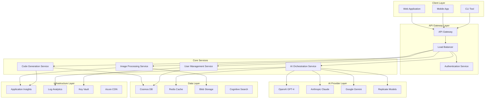
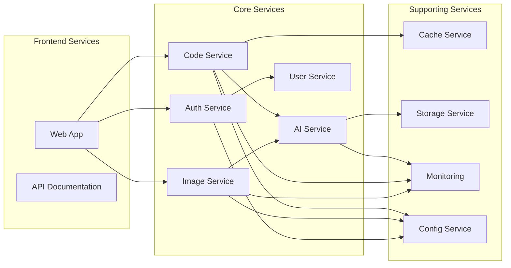
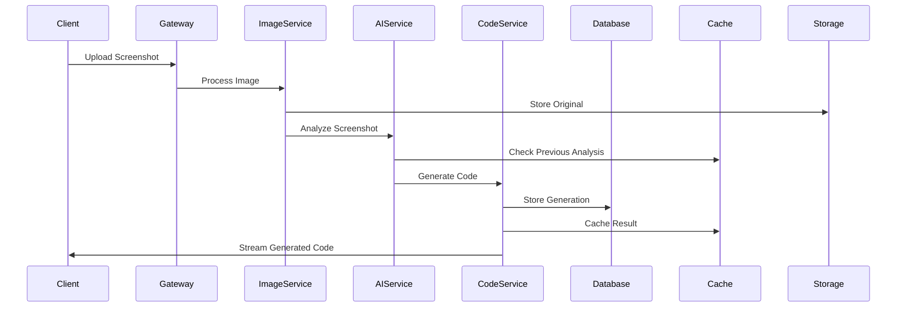

# Screenshot-to-Code System Architecture Documentation

**Version**: 1.0  
**Last Updated**: January 2025  
**Prepared for**: Knowledge Transfer and Team Onboarding  

---

## Table of Contents

1. [Executive Summary](#executive-summary)
2. [System Overview](#system-overview)
3. [Architecture Components](#architecture-components)
4. [Service Architecture](#service-architecture)
5. [Data Architecture](#data-architecture)
6. [Security Architecture](#security-architecture)
7. [Infrastructure Architecture](#infrastructure-architecture)
8. [Integration Patterns](#integration-patterns)
9. [Performance Architecture](#performance-architecture)
10. [Monitoring and Observability](#monitoring-and-observability)

---

## Executive Summary

The Screenshot-to-Code system is a comprehensive AI-powered application that converts screenshots into functional code using multiple AI providers and frameworks. The system is built using a microservices architecture with Azure cloud infrastructure, providing enterprise-grade scalability, security, and reliability.

### Key Architectural Principles
- **Microservices Architecture**: Loosely coupled services with clear boundaries
- **Cloud-Native Design**: Azure-first with multi-cloud readiness
- **AI Provider Agnostic**: Support for multiple AI providers with intelligent routing
- **Security by Design**: Zero-trust architecture with comprehensive security controls
- **Performance Optimized**: Multi-level caching and intelligent resource management
- **Observability First**: Comprehensive monitoring, logging, and alerting

### Technology Stack
- **Backend**: FastAPI (Python), Node.js for specific services
- **Frontend**: React with TypeScript, Vite build system
- **AI Integration**: OpenAI GPT-4, Anthropic Claude, Google Gemini
- **Cloud Platform**: Microsoft Azure (primary), multi-cloud ready
- **Database**: Azure Cosmos DB, Redis Cache
- **Messaging**: WebSocket for real-time communication
- **Container Platform**: Docker with Azure Container Instances
- **Orchestration**: Kubernetes for production workloads

---

## System Overview

### High-Level Architecture



### Core Principles

1. **Separation of Concerns**: Each service has a single, well-defined responsibility
2. **Scalability**: Horizontal scaling capabilities for all services
3. **Resilience**: Circuit breakers, retries, and graceful degradation
4. **Security**: Authentication, authorization, and data protection at every layer
5. **Observability**: Comprehensive monitoring, logging, and distributed tracing
6. **Performance**: Optimized for sub-5-second response times under load

---

## Architecture Components

### 1. API Gateway Service

**Purpose**: Central entry point for all client requests with routing, authentication, and rate limiting.

**Key Components**:
```python
# Core API Gateway Structure
services/
├── api-gateway/
│   ├── app/
│   │   ├── auth/                    # Authentication middleware
│   │   ├── routing/                 # Request routing logic
│   │   ├── middleware/              # Rate limiting, CORS, logging
│   │   ├── performance/             # Caching and optimization
│   │   ├── infrastructure/          # Azure resource management
│   │   └── deployment/              # Production deployment
│   ├── tests/                       # Comprehensive test suite
│   └── docs/                        # API documentation
```

**Responsibilities**:
- Request routing to appropriate microservices
- Authentication and authorization enforcement
- Rate limiting and DDoS protection
- Request/response transformation
- API versioning and backward compatibility
- Monitoring and logging aggregation

### 2. Image Processing Service

**Purpose**: Handle screenshot upload, validation, preprocessing, and analysis.

**Key Features**:
- Multi-format image support (PNG, JPG, WebP)
- Image validation and security scanning
- Preprocessing for AI optimization
- Metadata extraction and analysis
- Thumbnail generation and caching
- Storage integration with Azure Blob Storage

**Processing Pipeline**:
```yaml
Image Processing Flow:
  1. Upload Validation:
     - File format verification
     - Size and dimension limits
     - Security scanning for malicious content
     
  2. Preprocessing:
     - Image optimization and compression
     - Format standardization
     - Quality enhancement if needed
     
  3. Analysis:
     - UI element detection
     - Layout analysis
     - Text extraction (OCR)
     
  4. Storage:
     - Original image storage
     - Processed image variants
     - Metadata and analysis results
```

### 3. Code Generation Service

**Purpose**: Generate functional code from processed screenshots using AI providers.

**Architecture**:
```python
class CodeGenerationService:
    """Core service for AI-powered code generation"""
    
    components = {
        "prompt_engine": "Dynamic prompt generation based on UI analysis",
        "ai_orchestrator": "Multi-provider AI request management", 
        "response_processor": "Code validation and formatting",
        "template_engine": "Framework-specific code templates",
        "quality_validator": "Generated code quality assessment"
    }
    
    supported_frameworks = [
        "HTML + Tailwind CSS",
        "React + TypeScript", 
        "Vue.js + Composition API",
        "Angular + TypeScript",
        "React Native",
        "Flutter (Dart)"
    ]
```

**Generation Pipeline**:
```yaml
Code Generation Flow:
  1. Requirements Analysis:
     - Screenshot analysis results
     - User preferences and context
     - Target framework selection
     
  2. Prompt Engineering:
     - Dynamic prompt construction
     - Context injection
     - Framework-specific instructions
     
  3. AI Provider Selection:
     - Provider capability assessment
     - Cost optimization
     - Performance characteristics
     
  4. Code Generation:
     - Multi-provider request handling
     - Response aggregation
     - Quality scoring
     
  5. Post-Processing:
     - Code validation and formatting
     - Framework compliance checking
     - Security vulnerability scanning
     
  6. Response Delivery:
     - Real-time streaming to client
     - Version management
     - Feedback collection
```

### 4. AI Orchestration Service

**Purpose**: Manage interactions with multiple AI providers with intelligent routing and fallback.

**Provider Management**:
```python
class AIProviderOrchestrator:
    """Intelligent AI provider management and routing"""
    
    providers = {
        "openai": {
            "models": ["gpt-4-vision-preview", "gpt-4-turbo"],
            "capabilities": ["vision", "code_generation", "reasoning"],
            "cost_per_token": 0.03,
            "avg_response_time_ms": 2500
        },
        "anthropic": {
            "models": ["claude-3-opus", "claude-3-sonnet"],
            "capabilities": ["vision", "code_generation", "analysis"],
            "cost_per_token": 0.015,
            "avg_response_time_ms": 1800
        },
        "google": {
            "models": ["gemini-pro-vision", "gemini-pro"],
            "capabilities": ["vision", "code_generation", "multimodal"],
            "cost_per_token": 0.0025,
            "avg_response_time_ms": 2200
        }
    }
    
    routing_strategy = {
        "primary": "cost_optimization",
        "fallback": "performance_optimization", 
        "emergency": "availability_first"
    }
```

**Intelligent Routing Logic**:
```yaml
AI Provider Selection:
  1. Request Analysis:
     - Task complexity assessment
     - Required capabilities identification
     - User preferences consideration
     
  2. Provider Scoring:
     - Capability match score (40%)
     - Performance characteristics (30%)
     - Cost efficiency (20%)
     - Current availability (10%)
     
  3. Dynamic Routing:
     - Primary provider selection
     - Fallback provider preparation
     - Circuit breaker monitoring
     
  4. Quality Assurance:
     - Response quality scoring
     - Provider performance tracking
     - Adaptive routing adjustment
```

---

## Service Architecture

### Microservices Communication

**Communication Patterns**:

1. **Synchronous Communication**:
   - HTTP/REST for request-response patterns
   - GraphQL for complex data queries
   - WebSocket for real-time communication

2. **Asynchronous Communication**:
   - Azure Service Bus for reliable messaging
   - Event-driven architecture for loose coupling
   - Pub/Sub patterns for broadcast scenarios

3. **Data Consistency**:
   - Eventual consistency for non-critical operations
   - Strong consistency for user authentication
   - Saga pattern for distributed transactions

### Service Dependencies



### Service Configuration

**Configuration Management**:
```yaml
Configuration Hierarchy:
  1. Environment Variables (highest priority)
  2. Azure Key Vault secrets
  3. Configuration files (appsettings.json)
  4. Default values (lowest priority)

Configuration Categories:
  - Database connection strings
  - AI provider API keys and endpoints
  - Caching configuration
  - Performance tuning parameters
  - Security settings and certificates
  - Monitoring and logging configuration
```

---

## Data Architecture

### Database Design

**Azure Cosmos DB Structure**:

```json
{
  "databases": {
    "screenshot_to_code": {
      "containers": {
        "users": {
          "partition_key": "/user_id",
          "indexes": ["email", "created_at", "last_login"],
          "ttl": null
        },
        "projects": {
          "partition_key": "/user_id", 
          "indexes": ["project_id", "created_at", "framework"],
          "ttl": null
        },
        "generations": {
          "partition_key": "/user_id",
          "indexes": ["generation_id", "project_id", "created_at"],
          "ttl": 2592000
        },
        "sessions": {
          "partition_key": "/session_id",
          "indexes": ["user_id", "created_at"],
          "ttl": 86400
        }
      }
    }
  }
}
```

**Data Models**:

```python
# User Model
class User:
    user_id: str
    email: str
    name: str
    subscription_tier: str
    preferences: Dict[str, Any]
    usage_stats: Dict[str, int]
    created_at: datetime
    last_login: datetime

# Project Model  
class Project:
    project_id: str
    user_id: str
    name: str
    description: str
    framework: str
    generations: List[str]
    settings: Dict[str, Any]
    created_at: datetime
    updated_at: datetime

# Generation Model
class Generation:
    generation_id: str
    user_id: str
    project_id: str
    screenshot_url: str
    generated_code: str
    ai_provider: str
    model_used: str
    generation_time_ms: int
    quality_score: float
    created_at: datetime
```

### Caching Strategy

**Redis Cache Architecture**:

```yaml
Cache Layers:
  L1 - Application Cache:
    - In-memory caching for frequently accessed data
    - Short TTL (5-15 minutes)
    - User preferences, configuration data
    
  L2 - Redis Cache:
    - Distributed caching across service instances  
    - Medium TTL (1-24 hours)
    - Generated code, AI responses, image metadata
    
  L3 - CDN Cache:
    - Global edge caching for static content
    - Long TTL (24 hours - 7 days)
    - Images, static assets, API documentation

Cache Strategies:
  - Write-through for critical data
  - Write-behind for performance optimization
  - Cache-aside for flexible data management
  - Refresh-ahead for predictable access patterns
```

### Data Flow Architecture



---

## Security Architecture

### Zero Trust Security Model

**Security Principles**:
1. **Never Trust, Always Verify**: All requests authenticated and authorized
2. **Least Privilege Access**: Minimal required permissions only
3. **Assume Breach**: Monitor and detect suspicious activities
4. **Data Protection**: Encryption at rest and in transit
5. **Identity-Centric**: Identity-based access controls

### Authentication and Authorization

**Azure AD Integration**:
```yaml
Authentication Flow:
  1. Client Authentication:
     - OAuth 2.0 / OpenID Connect
     - JWT token validation
     - Multi-factor authentication support
     
  2. Service-to-Service:
     - Managed identities for Azure services
     - Certificate-based authentication
     - API key management for external services
     
  3. Authorization:
     - Role-based access control (RBAC)
     - Attribute-based access control (ABAC)
     - Resource-level permissions

Permission Matrix:
  - Anonymous: Public API documentation access
  - Free User: Basic code generation (limited)
  - Premium User: Advanced features, higher limits
  - Admin: User management, system configuration
  - System: Full access for internal services
```

### Data Security

**Encryption Strategy**:
```yaml
Data at Rest:
  - Azure Storage: AES-256 encryption
  - Cosmos DB: Transparent data encryption
  - Key Vault: HSM-backed key management
  
Data in Transit:
  - TLS 1.3 for all HTTP communications
  - Certificate pinning for critical connections
  - End-to-end encryption for sensitive data
  
Key Management:
  - Azure Key Vault for centralized key storage
  - Automatic key rotation
  - Hardware security module (HSM) backing
  - Separate keys per environment
```

### Network Security

**Network Architecture**:
```yaml
Network Segmentation:
  - Public Subnet: Load balancers, CDN endpoints
  - Private Subnet: Application services
  - Data Subnet: Databases, internal services
  - Management Subnet: Monitoring, administrative access

Security Controls:
  - Web Application Firewall (WAF) with OWASP rules
  - Network Security Groups (NSG) with least privilege
  - DDoS protection for public endpoints
  - Private endpoints for Azure services
  - VPN gateway for secure administrative access
```

---

## Infrastructure Architecture

### Azure Cloud Architecture

**Resource Topology**:
```yaml
Azure Resources:
  Resource Groups:
    - sktc-prod-rg: Production resources
    - sktc-staging-rg: Staging environment  
    - sktc-dev-rg: Development environment
    
  Compute:
    - Azure App Service: Web application hosting
    - Azure Container Instances: Microservices
    - Azure Functions: Serverless processing
    
  Storage:
    - Azure Cosmos DB: Primary database
    - Azure Redis Cache: Distributed caching
    - Azure Blob Storage: File and image storage
    - Azure Cognitive Search: Full-text search
    
  Networking:
    - Azure Virtual Network: Network isolation
    - Azure Load Balancer: Traffic distribution
    - Azure CDN: Global content delivery
    - Azure Private Link: Secure service access
    
  Security:
    - Azure Key Vault: Secrets management
    - Azure Active Directory: Identity provider
    - Azure Security Center: Security monitoring
    - Azure Sentinel: SIEM and SOAR
    
  Monitoring:
    - Azure Application Insights: APM
    - Azure Monitor: Infrastructure monitoring
    - Azure Log Analytics: Log aggregation
```

### Multi-Environment Strategy

**Environment Configuration**:
```yaml
Development:
  Scale: Minimal (1 instance per service)
  Database: Shared Cosmos DB with development tier
  AI Providers: Rate-limited API keys
  Monitoring: Basic logging and metrics
  
Staging:
  Scale: Medium (2-3 instances per service)
  Database: Dedicated Cosmos DB
  AI Providers: Production API keys with limits
  Monitoring: Full monitoring with shorter retention
  
Production:
  Scale: Auto-scaling (3-20 instances per service)
  Database: Premium Cosmos DB with geo-replication
  AI Providers: Full access with cost optimization
  Monitoring: Comprehensive monitoring with full retention
```

### Disaster Recovery

**Business Continuity Plan**:
```yaml
Recovery Objectives:
  - RTO (Recovery Time Objective): 15 minutes
  - RPO (Recovery Point Objective): 5 minutes
  
Backup Strategy:
  - Database: Automated backups every 4 hours
  - Storage: Geo-redundant storage with daily snapshots
  - Configuration: Infrastructure as Code (ARM templates)
  - Secrets: Azure Key Vault geo-replication
  
Failover Process:
  1. Automated health monitoring detects failure
  2. Traffic Manager redirects to secondary region
  3. Secondary services auto-scale to handle load
  4. Database failover to secondary region
  5. Monitoring and alerting on failover status
```

---

## Integration Patterns

### AI Provider Integration

**Multi-Provider Strategy**:
```python
class AIProviderIntegration:
    """Unified interface for multiple AI providers"""
    
    async def generate_code(self, prompt: str, provider: str = "auto") -> CodeGenerationResult:
        """Generate code using optimal AI provider"""
        
        # Provider selection logic
        if provider == "auto":
            provider = await self.select_optimal_provider(prompt)
        
        # Execute with fallback
        try:
            result = await self.providers[provider].generate(prompt)
            await self.track_usage(provider, result)
            return result
        except Exception as e:
            # Automatic fallback to secondary provider
            fallback_provider = self.get_fallback_provider(provider)
            result = await self.providers[fallback_provider].generate(prompt)
            await self.track_fallback(provider, fallback_provider, str(e))
            return result
```

### External Service Integration

**Integration Architecture**:
```yaml
External Integrations:
  AI Providers:
    - OpenAI API: GPT-4 Vision and text models
    - Anthropic API: Claude 3 models
    - Google AI: Gemini Pro models
    - Replicate: Open source models
    
  Azure Services:
    - Azure Cognitive Services: Image analysis
    - Azure Translator: Multi-language support
    - Azure Content Moderator: Safety filtering
    
  Third-Party Services:
    - Stripe: Payment processing
    - SendGrid: Email notifications  
    - Twilio: SMS notifications
    - GitHub: Code repository integration

Integration Patterns:
  - Circuit Breaker: Prevent cascading failures
  - Retry with Backoff: Handle transient failures
  - Bulkhead: Isolate failure domains
  - Timeout: Prevent hanging requests
  - Health Checks: Monitor service availability
```

### API Design Standards

**RESTful API Design**:
```yaml
API Standards:
  Versioning: /api/v1/, /api/v2/
  HTTP Methods: GET, POST, PUT, DELETE, PATCH
  Status Codes: Standard HTTP status codes
  Content Type: application/json (primary)
  
Request/Response Format:
  Request:
    - Consistent parameter naming (camelCase)
    - Validation on all inputs
    - Rate limiting headers
    
  Response:
    - Consistent response structure
    - Error details with action guidance
    - Pagination for large datasets
    - ETag support for caching

Documentation:
  - OpenAPI 3.0 specification
  - Interactive documentation (Swagger UI)
  - Code samples for popular languages
  - Postman collections for testing
```

---

## Performance Architecture

### Performance Optimization Strategy

**Multi-Level Optimization**:
```yaml
Performance Layers:
  1. Client-Side Optimization:
     - Code splitting and lazy loading
     - Image optimization and WebP format
     - Service worker for offline capability
     - Local storage for user preferences
     
  2. CDN and Edge Optimization:
     - Global CDN distribution
     - Edge caching for static content
     - Gzip compression
     - HTTP/2 and HTTP/3 support
     
  3. Application Optimization:
     - Async/await patterns for I/O operations
     - Connection pooling for databases
     - Request batching and deduplication
     - Memory management and garbage collection
     
  4. Infrastructure Optimization:
     - Auto-scaling based on metrics
     - Load balancing with health checks
     - Resource right-sizing
     - Container optimization
```

### Caching Architecture

**Comprehensive Caching Strategy**:
```python
class CacheManager:
    """Multi-level caching system"""
    
    cache_levels = {
        "L1": {
            "type": "in_memory",
            "ttl_seconds": 300,
            "max_size_mb": 256,
            "use_cases": ["user_preferences", "config_data"]
        },
        "L2": {
            "type": "redis_cluster", 
            "ttl_seconds": 3600,
            "max_size_gb": 10,
            "use_cases": ["ai_responses", "generated_code", "image_metadata"]
        },
        "L3": {
            "type": "cdn_cache",
            "ttl_seconds": 86400,
            "max_size_tb": 1,
            "use_cases": ["static_assets", "images", "documentation"]
        }
    }
    
    async def get_with_fallback(self, key: str) -> Any:
        """Get value with cache level fallback"""
        for level in ["L1", "L2", "L3"]:
            value = await self.cache_levels[level].get(key)
            if value:
                # Promote to higher cache levels
                await self.promote_cache_entry(key, value, level)
                return value
        return None
```

### Load Testing and Capacity Planning

**Performance Benchmarks**:
```yaml
Performance Targets:
  Response Time:
    - API endpoints: <500ms (95th percentile)
    - Code generation: <10s (95th percentile)
    - Image processing: <5s (95th percentile)
    
  Throughput:
    - Concurrent users: 1000+ simultaneous
    - Requests per second: 500+ sustained
    - Code generations per hour: 10,000+
    
  Resource Utilization:
    - CPU utilization: <70% average
    - Memory utilization: <80% average
    - Database RU/s: <80% of provisioned
    
Load Testing Scenarios:
  - Normal Load: 100 concurrent users
  - Peak Load: 500 concurrent users  
  - Stress Test: 1000+ concurrent users
  - Endurance Test: 24-hour sustained load
```

---

## Monitoring and Observability

### Monitoring Strategy

**Three Pillars of Observability**:

1. **Metrics**: Quantitative measurements
   - Application performance metrics
   - Infrastructure resource utilization
   - Business metrics and KPIs
   - Custom metrics for AI provider performance

2. **Logs**: Structured event records
   - Application logs with correlation IDs
   - Security audit logs
   - Performance logs
   - Error logs with stack traces

3. **Traces**: Request flow tracking
   - Distributed tracing across services
   - Performance bottleneck identification
   - Error propagation tracking
   - User journey mapping

### Monitoring Architecture

```yaml
Monitoring Stack:
  Application Performance:
    - Azure Application Insights: APM and user analytics
    - Custom dashboards for business metrics
    - Real-time alerting on performance degradation
    
  Infrastructure Monitoring:
    - Azure Monitor: Resource utilization and health
    - Container insights for microservices
    - Network monitoring and security
    
  Log Management:
    - Azure Log Analytics: Centralized log storage
    - Kusto queries for log analysis
    - Log retention policies by environment
    
  Alerting:
    - Multi-channel alerting (email, SMS, Slack)
    - Severity-based escalation procedures
    - Alert correlation and deduplication
    - Automated incident creation
```

### Health Checks and SLA Monitoring

**Health Check Framework**:
```python
class HealthCheckManager:
    """Comprehensive health monitoring"""
    
    health_checks = {
        "database_connectivity": {
            "check_interval_seconds": 30,
            "timeout_seconds": 5,
            "failure_threshold": 3,
            "critical": True
        },
        "ai_provider_availability": {
            "check_interval_seconds": 60,
            "timeout_seconds": 10,
            "failure_threshold": 2,
            "critical": False
        },
        "cache_performance": {
            "check_interval_seconds": 60,
            "timeout_seconds": 3,
            "failure_threshold": 5,
            "critical": False
        }
    }
    
    async def execute_health_checks(self) -> HealthStatus:
        """Execute all configured health checks"""
        results = {}
        overall_status = "healthy"
        
        for check_name, config in self.health_checks.items():
            try:
                result = await self.run_health_check(check_name, config)
                results[check_name] = result
                
                if result.status == "unhealthy" and config["critical"]:
                    overall_status = "unhealthy"
            except Exception as e:
                results[check_name] = {"status": "error", "error": str(e)}
                if config["critical"]:
                    overall_status = "unhealthy"
        
        return HealthStatus(
            overall_status=overall_status,
            checks=results,
            timestamp=datetime.utcnow()
        )
```

---

## Summary

This system architecture provides a robust, scalable, and secure foundation for the Screenshot-to-Code application. Key architectural decisions include:

1. **Microservices Architecture**: Enables independent scaling and deployment
2. **Multi-AI Provider Strategy**: Reduces vendor lock-in and optimizes costs
3. **Comprehensive Security**: Zero-trust model with defense in depth
4. **Performance Optimization**: Multi-level caching and intelligent resource management
5. **Cloud-Native Design**: Leverages Azure services for scalability and reliability
6. **Observability First**: Comprehensive monitoring and alerting

The architecture supports the current requirements while providing flexibility for future enhancements and scale.

---

**Document Prepared By**: Solution Architect  
**Review Status**: Ready for Technical Review  
**Next Steps**: Operations Runbook Creation