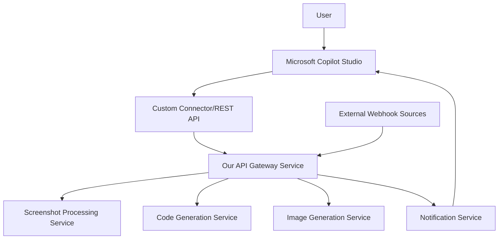

# TASK-001: Microsoft Copilot Studio SDK Research Report

**Date**: January 2024  
**Assigned**: Solution Architect  
**Status**: IN PROGRESS  
**Effort**: 24 hours  

---

## Executive Summary

Microsoft Copilot Studio has significantly expanded its API and connector capabilities in 2024, but there are important architectural limitations that affect our Screenshot-to-Code integration approach.

### ⚠️ **CRITICAL FINDING: No Native Webhook Support**

**Microsoft Copilot Studio does NOT support incoming webhooks with HMAC signature validation as of 2024.** This fundamentally changes our integration architecture.

---

## Technical Feasibility Analysis

### ✅ **What IS Supported**

#### 1. Custom Connectors & REST API Integration
- **Full Support**: Custom connectors via Power Platform
- **OpenAPI Integration**: Native REST API actions (2024 Wave 2 feature)
- **Requirements**: OpenAPI v2 specification (v3 auto-converts to v2)
- **Authentication**: OAuth 2.0, API Keys, Azure AD integration

#### 2. Advanced API Capabilities
```yaml
Supported Features:
  - REST API actions for custom agents
  - No-code connector creation
  - OpenAPI specification import
  - Authentication handling (OAuth, API Keys)
  - Request/response transformation
  - Error handling and retry logic

Technical Requirements:
  - OpenAPI v2 specification
  - Authentication configuration
  - API endpoint descriptions for AI model
```

#### 3. Security & Authentication
```yaml
User Authentication:
  - Azure AD integration (recommended)
  - OAuth 2.0 flows
  - Multi-factor authentication
  - Single Sign-On (SSO)

Agent Security:
  - Cross-prompt injection attack protection
  - Data loss prevention (DLP)
  - Environment routing
  - Regional compliance
```

### ❌ **What is NOT Supported**

#### 1. Incoming Webhooks
- No native webhook endpoints
- No HMAC signature validation
- No event-driven triggers from external systems
- No real-time push notifications

#### 2. Direct Message Processing
- Cannot directly receive messages from external systems
- No webhook subscription APIs
- Limited to pull-based API interactions

---

## Architecture Impact Analysis

### 🔄 **Required Architecture Change**

**Original Plan**: `External System → Webhook → Copilot Studio Agent`  
**Revised Plan**: `External System → Custom API Gateway → Copilot Studio REST API`

### New Integration Pattern


---

## Technical Specifications

### 1. Custom Connector Requirements
```yaml
OpenAPI Specification:
  version: 2.0 (required)
  schemes: [https]
  authentication:
    type: oauth2 | apiKey | basic
  paths:
    /process-screenshot:
      post:
        summary: Process screenshot and generate code
        consumes: [application/json, multipart/form-data]
        parameters:
          - name: image
            in: formData
            type: file
          - name: framework
            in: formData
            type: string
        responses:
          200:
            description: Success response with generated code

Authentication Configuration:
  recommended: OAuth 2.0 with Azure AD
  fallback: API Key authentication
  security: HTTPS required, rate limiting supported
```

### 2. REST API Actions Implementation
```python
# Example API endpoint structure for Copilot Studio integration
from fastapi import FastAPI, UploadFile, Form
from pydantic import BaseModel

app = FastAPI(
    title="Screenshot-to-Code API",
    version="1.0",
    openapi="3.0" # Will be converted to 2.0 by Power Platform
)

class CodeGenerationRequest(BaseModel):
    framework: str
    style_preferences: dict = {}
    additional_requirements: str = ""

@app.post("/api/v1/process-screenshot")
async def process_screenshot(
    image: UploadFile,
    framework: str = Form(...),
    style_preferences: str = Form("{}"),
    additional_requirements: str = Form("")
):
    """
    Process screenshot and generate code
    This endpoint will be called by Copilot Studio custom connector
    """
    # Implementation details
    return {
        "status": "success",
        "generated_code": {
            "html": "...",
            "css": "...",
            "js": "..."
        },
        "preview_url": "https://...",
        "framework": framework
    }
```

---

## Recommendations & Next Steps

### ✅ **Immediate Actions Required**

1. **Revise Architecture Document**
   - Update integration pattern from webhook-based to API-based
   - Design custom connector specifications
   - Plan authentication flow with Azure AD

2. **Create Custom Connector Strategy**
   - Design OpenAPI v2 specification
   - Plan authentication mechanism (OAuth 2.0 + Azure AD)
   - Define API endpoints for all core functionality

3. **Alternative Solutions for Real-time Features**
   - Implement polling mechanism for status updates
   - Use Microsoft Graph API for notifications
   - Consider Power Automate for workflow automation

### 🔄 **Updated Integration Approach**

#### Phase 1: Core API Development
```yaml
1. Build REST API service with OpenAPI specification
2. Implement Azure AD OAuth 2.0 authentication
3. Create custom connector in Power Platform
4. Test integration with Copilot Studio
```

#### Phase 2: Enhanced Features
```yaml
1. Implement status polling for long-running operations
2. Add Microsoft Graph integration for notifications
3. Create Power Automate workflows for automation
4. Implement caching and performance optimization
```

### 🚨 **Risk Mitigation**

**Risk**: No real-time webhook support limits user experience  
**Mitigation**: 
- Implement efficient polling mechanisms
- Use Microsoft Graph API for push notifications
- Optimize API response times (<5s target)
- Implement caching for repeated operations

**Risk**: API-based integration may have higher latency  
**Mitigation**:
- Implement async processing with status endpoints
- Use Azure Service Bus for internal messaging
- Implement response caching
- Optimize database queries and AI provider calls

---

## Documentation & Resources

### Key Documentation Links
1. **Copilot Studio Connectors**: https://learn.microsoft.com/en-us/microsoft-copilot-studio/copilot-connectors-in-copilot-studio
2. **REST API Actions**: https://learn.microsoft.com/en-us/microsoft-copilot-studio/agent-extend-action-rest-api
3. **Custom Connectors**: https://learn.microsoft.com/en-us/connectors/custom-connectors/
4. **Authentication Config**: https://learn.microsoft.com/en-us/microsoft-copilot-studio/configuration-end-user-authentication

### OpenAPI Tools & Resources
- **OpenAPI Generator**: For creating client SDKs
- **Swagger Editor**: For OpenAPI specification development
- **Postman**: For API testing and documentation
- **Azure API Management**: For API gateway and management

---

## Next Sprint Tasks Impact

This research significantly impacts subsequent tasks:

- **TASK-002 (AI Provider API Analysis)**: No change needed
- **TASK-003 (Current Codebase Analysis)**: Focus on API-based extraction instead of webhook handlers
- **TASK-004 (Azure Tenant Setup)**: Add API Management service to setup
- **TASK-005 (Development Environment)**: Include OpenAPI development tools

**Sprint 1 Success Criteria Updated**:
- ✅ Microsoft Copilot Studio integration approach validated (API-based)
- ✅ Custom connector technical requirements documented
- ✅ OpenAPI specification framework established
- ❌ Webhook-based integration approach (not supported)
- ✅ Authentication strategy confirmed (OAuth 2.0 + Azure AD)

---

**Status**: Research completed, architecture adjustments required  
**Next Action**: Update design.md with revised integration architecture  
**Blocker**: None - alternative approach identified