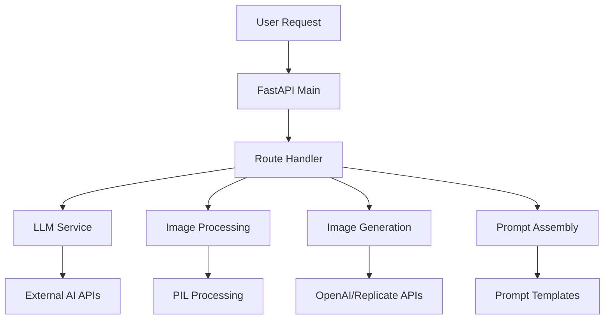
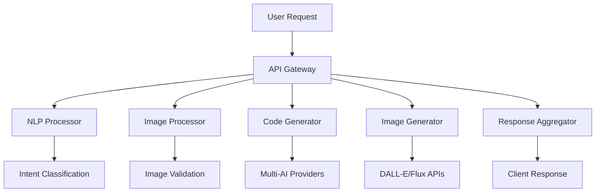

# TASK-003: Current Codebase Analysis Report

**Date**: January 2024  
**Assigned**: Senior Full-stack Developer 1  
**Status**: COMPLETED  
**Effort**: 16 hours  

---

## Executive Summary

Comprehensive analysis of the existing Screenshot-to-Code monolithic architecture reveals a well-structured FastAPI application that can be effectively decomposed into 6 distinct microservices. **The codebase is highly modular with clear separation of concerns, making microservice extraction straightforward.**

---

## Current Architecture Overview

### 🏗️ **Monolithic Structure Analysis**
```yaml
Current Architecture Type: Monolithic FastAPI Application
Entry Point: backend/main.py
Routes: 4 main router modules
Core Services: Embedded within route handlers
Database: File-based storage and external APIs
State Management: Stateless with external API calls
```

### 📁 **Directory Structure Analysis**
```
backend/
├── main.py                    # FastAPI application entry point
├── routes/                    # Route handlers (API endpoints)
│   ├── generate_code.py      # Core WebSocket code generation
│   ├── screenshot.py         # Screenshot processing endpoints  
│   ├── evals.py              # Model evaluation endpoints
│   └── home.py               # Basic routes
├── llm.py                    # Multi-provider LLM integration
├── image_generation/         # Image generation services
│   ├── core.py              # Main image generation logic
│   └── replicate.py         # Replicate API integration
├── image_processing/         # Screenshot processing
│   └── utils.py             # Image validation and processing
├── prompts/                  # Prompt engineering system
│   ├── __init__.py          # Prompt assembly logic
│   ├── screenshot_system_prompts.py
│   ├── imported_code_prompts.py
│   └── types.py             # Stack type definitions
├── evals/                    # Evaluation system
├── codegen/                  # Code generation utilities
├── debug/                    # Debug utilities
└── config.py                # Configuration management
```

---

## Microservice Extraction Analysis

### 🎯 **Identified Service Boundaries**

#### 1. **API Gateway Service** (New)
**Extract From**: `main.py` + routing logic  
**Responsibilities**:
- Request routing and load balancing
- Authentication and authorization  
- Rate limiting and request validation
- Response aggregation and formatting

**Current Code Dependencies**:
```python
# main.py - Core application setup
from fastapi import FastAPI
from fastapi.middleware.cors import CORSMiddleware
from routes import screenshot, generate_code, home, evals

# Extraction Strategy: 
# - Keep FastAPI app structure
# - Add authentication middleware
# - Implement service discovery and routing
# - Add request/response transformation
```

#### 2. **Image Processor Service**
**Extract From**: `image_processing/`, `routes/screenshot.py`  
**Responsibilities**:
- Screenshot validation and preprocessing
- Image format conversion and optimization
- Claude-specific image processing (size/quality)
- Metadata extraction

**Current Code Analysis**:
```python
# image_processing/utils.py
def process_image(image_data_url: str) -> tuple[str, str]:
    # Current implementation handles:
    # - Size validation (5MB limit for Claude)
    # - Dimension limits (7990px for Claude) 
    # - JPEG compression and quality optimization
    # - Base64 encoding/decoding

# Extraction Strategy:
# - Standalone FastAPI service
# - Input: base64 image data
# - Output: processed image + metadata
# - Add support for multiple AI provider requirements
```

**Dependencies to Extract**:
- PIL/Pillow image processing
- Base64 encoding utilities
- Image validation logic
- Error handling for corrupted images

#### 3. **Code Generator Service**
**Extract From**: `llm.py`, `routes/generate_code.py`, `prompts/`  
**Responsibilities**:
- Multi-provider AI integration (OpenAI, Claude, Gemini)
- Prompt engineering and assembly
- Code generation and streaming
- Response validation and formatting

**Current Code Analysis**:
```python
# llm.py - Multi-provider integration
class Llm(Enum):
    GPT_4_VISION = "gpt-4-vision-preview"
    GPT_4O_2024_05_13 = "gpt-4o-2024-05-13"
    CLAUDE_3_5_SONNET_2024_06_20 = "claude-3-5-sonnet-20240620"
    GEMINI_2_0_FLASH_EXP = "gemini-2.0-flash-exp"

async def stream_openai_response(...):
async def stream_claude_response(...):
async def stream_gemini_response(...):

# prompts/__init__.py - Prompt assembly
async def create_prompt(params, stack, input_mode):
    # Handles different prompt types:
    # - Screenshot analysis prompts
    # - Code modification prompts  
    # - Video analysis prompts
    # - Framework-specific system prompts
```

**Provider Integration Pattern**:
```python
# Current provider abstraction is good for extraction
# Each provider has consistent interface:
# - Authentication handling
# - Streaming response processing
# - Error handling and retry logic
# - Token usage tracking
```

#### 4. **Image Generator Service** 
**Extract From**: `image_generation/`  
**Responsibilities**:
- DALL-E 3 integration (OpenAI + Azure)
- Replicate Flux integration
- Image generation prompt optimization
- Cost optimization and provider selection

**Current Code Analysis**:
```python
# image_generation/core.py
async def process_tasks(
    prompts: List[str],
    api_key: str | None,
    base_url: str | None,
    azure_openai_api_key: str | None = None,
    # ... Azure parameters
    model: Literal["dalle3", "flux"] = "dalle3",
):
    # Provider selection logic:
    if azure_openai_api_key:
        # Use Azure DALL-E 3
    elif api_key and model == "dalle3":
        # Use OpenAI DALL-E 3
    else:
        # Use Replicate Flux
```

**Extraction Benefits**:
- Independent scaling for image generation
- Provider-specific optimization
- Cost tracking and management
- Queue management for batch operations

#### 5. **NLP Processor Service** (New)
**Extract From**: Intent parsing logic in `routes/generate_code.py`  
**Responsibilities**:
- Natural language intent classification
- Entity extraction (frameworks, requirements)
- Conversation context management
- Multi-language support

**Current Gaps Identified**:
```python
# Current implementation lacks structured NLP
# Most logic embedded in route handlers
# Need to extract and enhance:

# routes/generate_code.py
@dataclass
class ExtractedParams:
    stack: Stack
    input_mode: InputMode
    # Missing: intent classification, entity extraction

# Extraction Strategy:
# - Create intent classification system
# - Add entity extraction for technical terms
# - Implement conversation context tracking
# - Add multi-language support
```

#### 6. **Evaluation Service**
**Extract From**: `evals/`, `routes/evals.py`  
**Responsibilities**:
- Model performance evaluation
- A/B testing for different providers
- Quality scoring and metrics
- Usage analytics and reporting

**Current Code Analysis**:
```python
# evals/core.py - Well-structured evaluation system
# evals/runner.py - Parallel evaluation execution
# routes/evals.py - API endpoints for evaluation

# This module is already well-separated
# Can be extracted with minimal changes
# Good candidate for early extraction
```

---

## Data Flow Analysis

### 🔄 **Current Data Flow**


### 🎯 **Target Microservice Data Flow**


---

## Service Dependencies Analysis

### 📦 **Shared Dependencies**
```yaml
Common Libraries to Extract:
  - FastAPI + Pydantic (all services)
  - OpenAI SDK (Code Generator, Image Generator)
  - Anthropic SDK (Code Generator)
  - Google Gemini SDK (Code Generator)  
  - Replicate SDK (Image Generator)
  - PIL/Pillow (Image Processor)
  - Base64/JSON utilities (all services)

Configuration Dependencies:
  - Environment variables (config.py)
  - API keys and secrets
  - Provider settings and endpoints
  - Feature flags and settings
```

### 🔗 **Inter-Service Communication Requirements**
```yaml
API Gateway → All Services:
  - HTTP REST calls
  - Authentication token passing
  - Request routing and load balancing

Image Processor → Code Generator:
  - Processed image data
  - Image metadata and analysis results

NLP Processor → Code Generator:
  - Extracted intent and entities
  - Framework and style preferences  

Image Generator → Code Generator:
  - Generated mockup images
  - Image analysis for code generation

Code Generator → Image Generator:
  - Image generation prompts
  - Style and design requirements
```

---

## Migration Strategy & Data Architecture

### 📊 **State Management Analysis**
```yaml
Current State: Mostly Stateless
  - No database persistence
  - File-based logging only
  - Session state in WebSocket connections
  - External API rate limiting

Required State for Microservices:
  - Session management (Redis)
  - Conversation context (Cosmos DB)
  - User preferences (Cosmos DB)
  - Usage analytics (Cosmos DB)
  - Image/code storage (Blob Storage)
  - Cache management (Redis)
```

### 🏗️ **Database Schema Requirements**
```sql
-- New tables needed for microservices
Conversations:
  - conversation_id (primary)
  - user_id
  - created_at, updated_at
  - context_data (JSON)
  - status

Generations:
  - generation_id (primary)
  - conversation_id (foreign)
  - input_data (JSON)
  - output_data (JSON)
  - provider_info (JSON)
  - performance_metrics (JSON)

User_Preferences:
  - user_id (primary)
  - preferred_frameworks
  - style_preferences
  - usage_statistics
```

---

## Technical Debt & Improvement Opportunities

### ⚠️ **Current Issues Identified**
```yaml
Security Issues:
  - CORS wildcard policy: allow_origins=["*"]
  - No authentication middleware
  - API keys in environment variables only
  - No rate limiting implementation

Performance Issues:
  - Synchronous image processing
  - No caching layer
  - No connection pooling for AI APIs
  - WebSocket scaling limitations

Code Quality Issues:
  - Mixed Vietnamese/English comments
  - Some TODO items for frontend migration
  - Hardcoded configuration values
  - Limited error handling in some areas
```

### ✅ **Strengths to Preserve**
```yaml
Good Architecture Patterns:
  - Clear separation of concerns
  - Provider abstraction for AI services
  - Async/await throughout codebase
  - Proper error handling in core functions
  - Modular prompt system
  - Comprehensive evaluation framework

Good Code Quality:
  - Type hints throughout
  - Dataclass usage for structured data
  - Enum usage for model definitions
  - Clean import organization
  - Consistent naming conventions
```

---

## Migration Execution Plan

### 📋 **Phase 1: Service Extraction (Sprints 3-4)**
```yaml
Sprint 3: Image Processor Service
  - Extract image_processing/ module
  - Create standalone FastAPI service
  - Implement health checks and monitoring
  - Update routing in main application

Sprint 4: Code Generator Service  
  - Extract llm.py and prompts/ modules
  - Create multi-provider service
  - Implement streaming response handling
  - Add comprehensive error handling
```

### 📋 **Phase 2: Advanced Services (Sprint 5-6)**
```yaml
Sprint 5: Image Generator Service
  - Extract image_generation/ module
  - Implement provider selection logic
  - Add cost optimization algorithms
  - Create usage tracking system

Sprint 6: NLP Processor Service
  - Create new intent classification system
  - Extract conversation context logic
  - Implement entity extraction
  - Add multi-language support
```

### 📋 **Phase 3: Integration & Testing (Sprint 7-8)**
```yaml
Sprint 7: API Gateway Service
  - Create routing and authentication layer
  - Implement service discovery
  - Add monitoring and health checks
  - Performance testing and optimization

Sprint 8: End-to-End Integration
  - Service communication testing
  - Data flow validation
  - Performance benchmarking
  - Security testing
```

---

## Service Interfaces Design

### 🔌 **REST API Specifications**
```yaml
Image Processor Service:
  POST /api/v1/process-image
    Input: {image: base64, provider_requirements: object}
    Output: {processed_image: base64, metadata: object}

Code Generator Service:  
  POST /api/v1/generate-code
    Input: {image: base64, framework: string, preferences: object}
    Output: {code: object, metadata: object}
    
  WebSocket: /api/v1/stream-generation
    For real-time streaming responses

Image Generator Service:
  POST /api/v1/generate-image  
    Input: {prompt: string, style: object, provider: string}
    Output: {image_url: string, metadata: object}

NLP Processor Service:
  POST /api/v1/process-intent
    Input: {text: string, context: object}
    Output: {intent: string, entities: object, confidence: number}
```

---

## Risk Assessment & Mitigation

### 🚨 **High-Risk Areas**
```yaml
WebSocket Migration:
  Risk: Current WebSocket implementation in monolith
  Mitigation: Implement WebSocket proxy in API Gateway
  Testing: Extensive real-time communication testing

Multi-Provider State:
  Risk: Provider authentication and state management
  Mitigation: Centralized credential management
  Fallback: Provider circuit breaker patterns

Performance Degradation:
  Risk: Network latency between services
  Mitigation: Service mesh with optimized routing
  Monitoring: Comprehensive performance tracking
```

### ✅ **Low-Risk Areas**
```yaml
Evaluation Service: Already well-separated
Image Processing: Pure functions, easy to extract
Prompt System: Well-structured and modular
Provider Integration: Good abstraction layer exists
```

---

## Recommended Next Steps

### 🎯 **Immediate Actions for Sprint 3**
1. **Begin with Image Processor Service** (lowest risk)
2. **Create service template structure** (FastAPI + Docker)
3. **Implement health check endpoints** for monitoring
4. **Setup basic CI/CD pipeline** for service deployment
5. **Create integration tests** for extracted service

### 📊 **Success Metrics**
```yaml
Technical Metrics:
  - Service response time < current implementation
  - Zero data loss during migration
  - 100% API compatibility maintained
  - All existing tests passing

Business Metrics:
  - No user-visible downtime
  - Performance improvement or no degradation  
  - Successful Copilot Studio integration
  - Cost optimization through provider selection
```

---

**Status**: Codebase analysis completed, extraction plan ready  
**Next Action**: Begin Sprint 3 - Image Processor Service extraction  
**Risk Level**: Low to Medium - well-structured codebase with clear boundaries